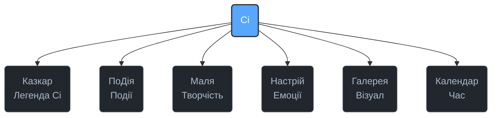

# ciwiki

## Повідомлення

Цей репозиторій є бібліотекою сенсів та знань проекту **Cimeika**.  
Тут формується теоретична база, яка підживлює усі модулі системи.  
Це місце для щоденних досліджень, публікацій і структурування матеріалів.  

---

## Завдання

1. Збирати та зберігати матеріали, що стосуються Легенди Ci та інших розділів.  
2. Давати логічну основу для розвитку Cimeika через науково підтверджені факти, емоційні образи та інтерактивні активності.  
3. Створювати просту, зрозумілу для кожного форму подачі, яка одночасно цікава і практична.  
4. Поступово структурувати простір у 7 основних розділів (Казкар, ПоДія, Маля, Настрій, Галерея, Календар, Ci).

---

## Результат

- **Теоретичний каркас**: чітко визначені розділи та їхня логіка.  
- **Практичні приклади**: експерименти, спостереження, ігри.  
- **Емоційне наповнення**: метафори, образи, гумор.  
- **Візуальна карта**: дерево 7 розділів як основа для навігації.  

---

## Структура (Mermaid)



---

## Документація

Документація проекту доступна у форматі MkDocs з матеріальною темою. Структура документації відображає ієрархію модулів Cimeika:

### Структура навігації:
- **Cimeika**
  - **Ci** (Центральний інтелект)
    - ПоДія (Події та сценарії)
    - Казкар (Наратив, пам'ять, смисли)
      - Легенда Ci
    - Настрій (Емоційні стани)
    - Маля (Творчість і навчання)
  - Календар (Ритм і прив'язка у часі)
  - Галерея (Візуальні історії)

Для перегляду документації локально:
```bash
pip install mkdocs mkdocs-material
mkdocs serve
```

---

## CI

