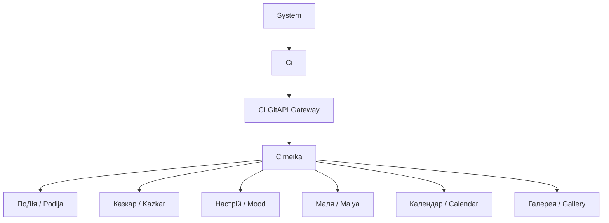
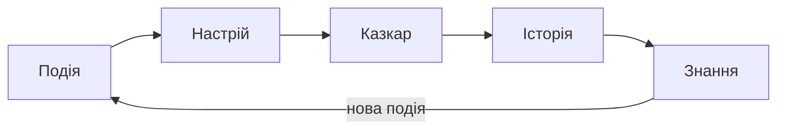

# Архітектура Cimeika

> **Cimeika** — інтерактивний простір знань, побудований навколо моделі Ci.

## Концепція

Cimeika перетворює:

```
Подія → Емоція → Історія → Знання
```

Система працює як екосистема подій, емоцій, історій та знань.

**Формула системи:**
```
Ci = Подія + Настрій + Історія + Пам'ять
```

---

## Архітектурна ієрархія



**CI GitAPI** — єдина адміністративна одиниця. Усі сервіси екосистеми взаємодіють між собою виключно через CI GitAPI Gateway. Докладніше: [CI GitAPI](../ci-gitapi/index.md).

---

## Модулі системи

| Модуль | Ключ | Роль |
|---|---|---|
| **ПоДія** | `podija` | Управління подіями |
| **Казкар** | `kazkar` | Генерація та зберігання історій |
| **Настрій** | `mood` | Емоційний стан системи |
| **Маля** | `malya` | Творчість та навчання |
| **Календар** | `calendar` | Часова структура подій |
| **Галерея** | `gallery` | Медіа-пам'ять |

---

## Цикл Ci



---

## 1️⃣ ПоДія

Модуль управління подіями.

**Функції:** `create_event`, `update_event`, `delete_event`, `list_events`

**Структура події:**

```
Event
 ├ id
 ├ title
 ├ description
 ├ date
 ├ tags
 ├ mood
 └ media
```

---

## 2️⃣ Казкар

Модуль генерації та інтерпретації історій.

**Призначення:** інтерпретація подій, створення легенд, формування знань.

**Функції:** `generate_story`, `interpret_event`, `create_legend`

---

## 3️⃣ Настрій

Модуль емоційного стану.

**Функції:** `mood_checkin`, `mood_history`, `emotion_graph`

**Шкала:**

```
0  –  -  =  +  1
```

---

## 4️⃣ Маля

Модуль творчості та навчання (дитячий режим).

**Функції:** `create_art`, `play_activity`, `learning_mode`

---

## 5️⃣ Календар

Часова структура подій.

**Функції:** `view_calendar`, `add_event`, `export_ics`

---

## 6️⃣ Галерея

Модуль медіа-пам'яті.

**Функції:** `upload_media`, `tag_media`, `attach_to_event`, `media_gallery`

---

## API

```
GET  /api/events
POST /api/events

GET  /api/mood
POST /api/mood

GET  /api/gallery
POST /api/gallery

POST /api/kazkar/generate
```

---

## MVP план

| Етап | Модуль | Пріоритет |
|---|---|---|
| 1️⃣ | Core система (Ci Engine) | Критичний |
| 2️⃣ | ПоДія | Критичний |
| 3️⃣ | Настрій | Високий |
| 4️⃣ | Казкар | Високий |
| 5️⃣ | Галерея | Середній |
| 6️⃣ | Календар | Середній |
| 7️⃣ | Маля | Плановий |

---

## Посилання

- [CI GitAPI](../ci-gitapi/index.md) — єдина адміністративна одиниця, Authorization & Coordination Gateway
- [Виробнича структура](./production-structure.md) — повна структура папок
- [UI Рефакторинг](./ui-refactoring-plan.md) — план уніфікації інтерфейсу
- [Legend Ci](../kazkar/legend-ci/index.md) — канонічна документація концепцій
- [Ci Production Spec](../ci/production-spec.md) — специфікація Ci
