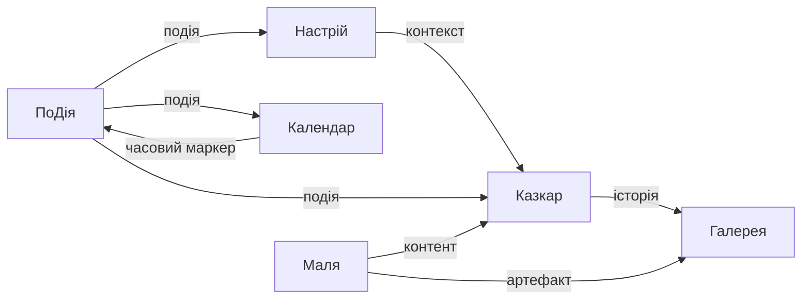

# Виробнича структура Cimeika

> Повна структура папок проєкту (production architecture).

---

## Репозиторій `cimeika/`

```
cimeika/
│
├── core/                         # Ядро системи
│   ├── ci_engine/                # Центральний оркестратор Ci
│   ├── event_engine/             # Обробка подій
│   └── automation/               # Автоматизація процесів
│
├── modules/                      # Модулі екосистеми
│   ├── podija/                   # ПоДія — управління подіями
│   ├── kazkar/                   # Казкар — генерація історій
│   ├── mood/                     # Настрій — емоційний стан
│   ├── malya/                    # Маля — творчість і навчання
│   ├── calendar/                 # Календар — часова структура
│   └── gallery/                  # Галерея — медіа-пам'ять
│
├── api/                          # API шар
│   ├── events/                   # /api/events
│   ├── mood/                     # /api/mood
│   ├── media/                    # /api/gallery
│   └── stories/                  # /api/kazkar
│
├── ui/                           # Інтерфейс
│   ├── components/               # Спільні UI компоненти
│   └── pages/                    # Сторінки модулів
│
├── storage/                      # Сховище даних
│   └── shared/                   # Спільні дані
│       └── calendar.json         # Events storage
│
├── scripts/                      # Утиліти та скрипти
├── docs/                         # Документація
└── tests/                        # Тести
```

---

## Деталізація модулів

### `core/ci_engine/`

```
ci_engine/
├── orchestrator.py               # Основний оркестратор
├── state_machine.py              # CiState: було → є → буде
└── module_registry.py            # Реєстр модулів
```

### `modules/podija/`

```
podija/
├── intent_extractor.py           # Парсинг природньої мови
├── event_manager.py              # CRUD для подій
├── calendar_storage.py           # Робота з calendar.json
└── types.py                      # Event типи
```

### `modules/kazkar/`

```
kazkar/
├── story_generator.py            # generate_story
├── event_interpreter.py          # interpret_event
├── legend_builder.py             # create_legend
└── narrative_engine.py           # Наративні шари
```

### `modules/mood/`

```
mood/
├── checkin.py                    # mood_checkin
├── history.py                    # mood_history
├── emotion_graph.py              # emotion_graph
└── scale.py                      # Шкала: 0 – - = + 1
```

### `modules/malya/`

```
malya/
├── art_creator.py                # create_art
├── play_activity.py              # play_activity
├── learning_mode.py              # learning_mode
└── micro_tasks.py                # Мікрозавдання 5-10 хв
```

### `modules/calendar/`

```
calendar/
├── view.py                       # view_calendar
├── events.py                     # add_event
└── export.py                     # export_ics
```

### `modules/gallery/`

```
gallery/
├── upload.py                     # upload_media
├── tagger.py                     # tag_media
├── event_attach.py               # attach_to_event
└── gallery_view.py               # media_gallery
```

### `api/`

```
api/
├── events/
│   ├── get.py                    # GET  /api/events
│   └── post.py                   # POST /api/events
├── mood/
│   ├── get.py                    # GET  /api/mood
│   └── post.py                   # POST /api/mood
├── media/
│   ├── get.py                    # GET  /api/gallery
│   └── post.py                   # POST /api/gallery
└── stories/
    └── generate.py               # POST /api/kazkar/generate
```

### `ui/`

```
ui/
├── components/
│   ├── CiFAB/                    # Floating Action Button (єдина навігація)
│   ├── ModuleView/               # Уніфікований view модуля
│   └── BackgroundTheme/          # Динамічні теми
└── pages/
    ├── WelcomePage/              # /
    ├── CiPage/                   # /ci
    ├── PodijaPage/               # /podija
    ├── MoodPage/                 # /nastrij
    ├── KazkarPage/               # /kazkar
    ├── CalendarPage/             # /calendar
    ├── GalleryPage/              # /gallery
    └── MalyaPage/                # /malya
```

---

## Репозиторій `ciwiki/` (документація)

```
ciwiki/
│
├── docs/
│   ├── architecture/             # Архітектура системи
│   │   ├── index.md              # Огляд архітектури + діаграми
│   │   └── production-structure.md  # Цей файл
│   ├── ci/                       # Ci специфікація
│   ├── Cimeika/                  # Документація модулів
│   │   ├── Ci/
│   │   ├── ПоДія/
│   │   ├── Казкар/
│   │   ├── Настрій/
│   │   ├── Маля/
│   │   ├── Календар/
│   │   └── Галерея/
│   ├── kazkar/legend-ci/         # Legend CI матеріали
│   ├── processes/                # Процеси розробки
│   └── abilities/                # Здібності системи
│
├── scripts/                      # Build скрипти
├── .github/                      # GitHub Actions та шаблони
└── mkdocs.yml                    # Навігація документації
```

---

## Зв'язки між модулями



---

## Посилання

- [Архітектурний огляд](./index.md) — концепція та діаграми
- [UI Рефакторинг](./ui-refactoring-plan.md) — план уніфікації інтерфейсу
- [Ci Production Spec](../ci/production-spec.md) — специфікація Ci FAB та токенів
