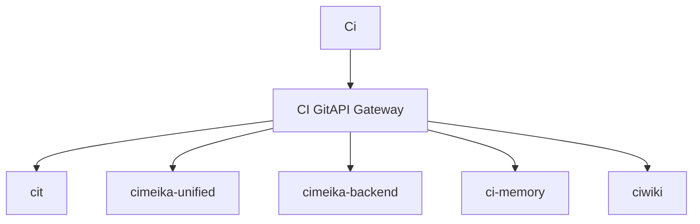

# CI GitAPI

> **CI GitAPI** — єдина адміністративна одиниця Cimeika. Authorization & Coordination Gateway для всієї екосистеми.

Репозиторій: [`Ihorog/ci_gitapi`](https://github.com/Ihorog/ci_gitapi)

---

## Роль у системі

CI GitAPI — це центральний шлюз, через який проходить **уся координація** між сервісами Cimeika:

- авторизація та автентифікація запитів
- координація між репозиторіями екосистеми
- управління Git-операціями та workflow-автоматизацією
- точка входу для всіх адміністративних дій

---

## Документація

- **[Специфікація](./spec.md)** — повний опис gateway endpoints, авторизація, формати запитів/відповідей.
- **[Інтеграція](./integration.md)** — як кожен модуль Cimeika взаємодіє з CI GitAPI.

---

## Стан

| Параметр | Значення |
|----------|---------|
| Репозиторій | `Ihorog/ci_gitapi` |
| Роль | Authorization & Coordination Gateway |
| Статус | Active |
| Моніторинг | [Check CI Runs ability](../abilities/check_ci_runs/README.md) |
