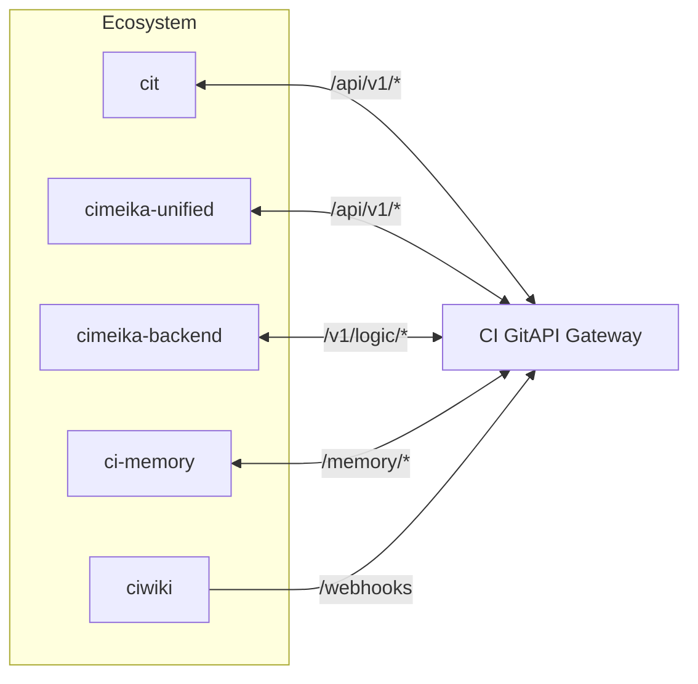

# CI GitAPI · Інтеграція з екосистемою

> Опис того, як кожен репозиторій і модуль Cimeika взаємодіє з CI GitAPI.

---

## Принцип

**Усі сервіси Cimeika звертаються один до одного виключно через CI GitAPI.**

---

## Репозиторії та їхні точки інтеграції

### `cit` — основний frontend

| Дія | Endpoint | Статус |
|-----|----------|--------|
| Отримання стану системи | `GET /v1/status` | 🔲 |
| Читання пам'яті | `GET /memory/*` | 🔲 |

### `cimeika-unified` — уніфікована інтеграція

| Дія | Endpoint | Статус |
|-----|----------|--------|
| Стан ecosystem | `GET /v1/ecosystem` | 🔲 |
| Тригер автоматизації | `POST /api/v1/automation` | 🔲 |
| Створення PR | `POST /api/v1/automation/pr` | 🔲 |

### `cimeika-backend` — Cloudflare Workers

| Дія | Endpoint | Статус |
|-----|----------|--------|
| Виконання логіки | `POST /v1/logic/*` | 🔲 |
| Git-операції | `GET /v1/git/*` | 🔲 |

### `ci-memory` — жива пам'ять

| Дія | Endpoint | Статус |
|-----|----------|--------|
| Запис контексту | `POST /memory/*` | 🔲 |
| Читання контексту | `GET /memory/*` | 🔲 |

### `ciwiki` — документація (цей репозиторій)

| Дія | Endpoint | Статус |
|-----|----------|--------|
| Моніторинг CI runs | GitHub API (через ability) | ✅ Активно |
| Отримання webhook подій | `POST /webhooks` | 🔲 |

---

## Abilities та CI GitAPI

### `check_ci_runs` (active)

Ability моніторить CI GitAPI репозиторій безпосередньо:

- **Ціль**: `Ihorog/ci_gitapi`
- **Спосіб**: GitHub API (не через gateway endpoint)
- **Результат**: звіт останніх 7 workflow runs

Деталі: [Check CI Runs](../abilities/check_ci_runs/README.md)

### `audit_supabase` (dormant)

Ability читатиме стан Supabase DB через CI GitAPI після активації:

- **Споживачі**: `cit`, `ci_gitapi`, `cimeika-unified`, `cimeika-backend`, `ci-memory`
- **Наступний крок**: додати workflow у `Ihorog/ci_gitapi`

Деталі: [Audit Supabase](../abilities/audit_supabase/README.md)

---

## Rollout план

| Крок | Репозиторій | Дія | Статус |
|------|-------------|-----|--------|
| 1 | `ciwiki` | Документація CI GitAPI | ✅ |
| 2 | `ci_gitapi` | Активувати `/health` та `/v1/status` | 🔲 |
| 3 | `ci_gitapi` | Реалізувати `/api/v1/automation/pr` | 🔲 |
| 4 | `cimeika-unified` | Підключити до gateway | 🔲 |
| 5 | `cit` | Підключити авторизацію | 🔲 |
| 6 | `cimeika-backend` | Маршрутизувати логіку через `/v1/logic/*` | 🔲 |
| 7 | `ci-memory` | Підключити `/memory/*` | 🔲 |
| 8 | Усі | Активувати `audit_supabase` | 🔲 |

---

*Документ є частиною канонічної документації ciwiki. Зміни — через PR → review → merge.*
