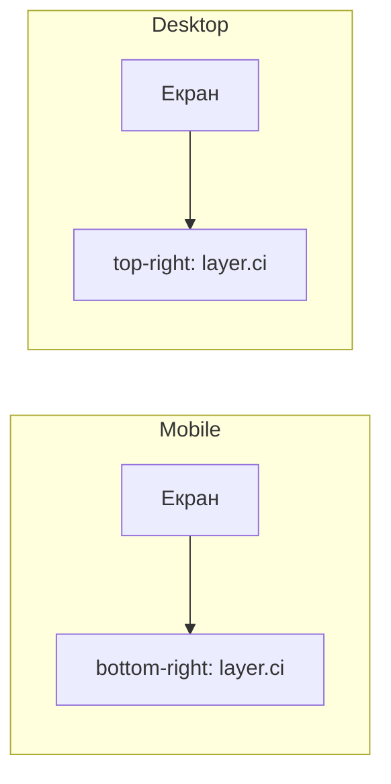
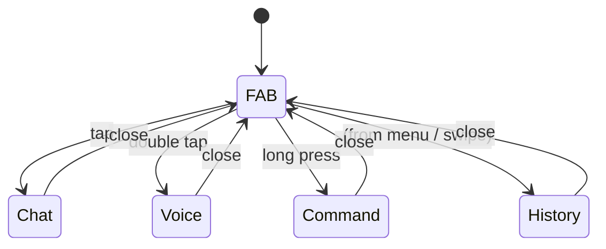

# Cimeika · Ci Core · Production Spec

> **Canonical reference** for all Cimeika nodes implementing the Ci orchestration layer.  
> Approved changes to this document must be made via PR to `ciwiki` main.

---

## 1. Роль Ci (Role of Ci)

**Ci** — глобальний центр оркестрації Cimeika. Singleton.

- Єдиний екземпляр на всій платформі (не дублюється між модулями).
- Відповідає за координацію всіх подій, станів і взаємодій між модулями.
- Доступний із будь-якого екрану та будь-якого контексту.

---

## 2. Global Ci FAB

Плаваюча кнопка дії (Floating Action Button) присутня на **кожному екрані** платформи.

### Правила позиціонування

| Платформа | Позиція          | Токен шару   |
|-----------|-----------------|--------------|
| Mobile    | bottom-right    | `layer.ci`   |
| Desktop   | top-right       | `layer.ci`   |

- Позиція задається виключно через дизайн-токени; жодних хардкодних значень.
- Z-index / layering визначається токеном **`layer.ci`** (завжди вище за інший контент).

### Діаграма позиціонування



---

## 3. Жести (Gestures)

| Жест           | Дія                   | Overlay     |
|---------------|-----------------------|-------------|
| Tap (одиночний)| Відкрити Chat         | Chat overlay |
| Double tap     | Відкрити Voice        | Voice overlay |
| Long press     | Відкрити Command      | Command overlay |

---

## 4. Оверлеї (Overlays)

Ci підтримує чотири оверлеї:

| Оверлей   | Опис                                                              |
|-----------|-------------------------------------------------------------------|
| **Chat**    | Текстовий діалог із Ci; базовий режим взаємодії.                |
| **Voice**   | Голосове введення та відповідь; активується double-tap або голосом. |
| **Command** | Швидке введення команд; keyboard-first; для досвідчених користувачів. |
| **History** | Перегляд попередніх сесій та взаємодій із Ci.                   |



---

## 5. Правила стилізації (Token-only Styling)

**Заборонено** хардкодити кольори, відступи, радіуси та тіні.  
Всі стилі задаються **виключно через дизайн-токени**.

### Обов'язкові групи токенів

| Група      | Приклади                                      |
|------------|-----------------------------------------------|
| `color.*`    | `color.ci.primary`, `color.ci.surface`       |
| `typography.*` | `typography.ci.label`, `typography.ci.body` |
| `spacing.*`  | `spacing.ci.gap`, `spacing.ci.padding`       |
| `radius.*`   | `radius.ci.fab`, `radius.ci.overlay`         |
| `shadow.*`   | `shadow.ci.fab`, `shadow.ci.overlay`         |
| `motion.*`   | `motion.ci.enter`, `motion.ci.exit`          |
| `component.*`| `component.ci.fab`, `component.ci.overlay`  |
| `ci.*`       | `ci.fab.size`, `ci.overlay.width`            |
| `layer.*`    | `layer.ci` (z-index/layering)                |

---

## 6. Управління станом (State Management)

### CiState

```
idle → active → listening → processing → error → idle
```

| Стан          | Опис                                         |
|---------------|----------------------------------------------|
| `idle`        | Ci присутній, але не активований.            |
| `active`      | FAB натиснутий, оверлей відкривається.        |
| `listening`   | Голосове введення або очікування вводу.       |
| `processing`  | Ci обробляє запит.                           |
| `error`       | Сталася помилка; показується feedback.        |

### Доступність стану оверлею

- Стан усіх оверлеїв (`isOpen`, `activeOverlay`) доступний **глобально** (наприклад, через window/store).
- Компоненти читають стан із єдиного джерела; не зберігають локальних копій.

---

## 7. Доступність (Accessibility)

- FAB та всі оверлеї мають коректні ARIA-атрибути (`role`, `aria-label`, `aria-expanded`).
- Keyboard navigation: Tab → FAB → Enter/Space для відкриття Chat; Escape — закриття оверлею.
- Contrast ratio ≥ 4.5:1 для всіх текстових елементів (відповідно до WCAG 2.1 AA).
- Motion: поважається `prefers-reduced-motion`.

---

## 8. Обмеження продуктивності (Performance Constraints)

- FAB рендериться з пріоритетом: не блокує LCP основного екрану.
- Оверлеї завантажуються ліниво (lazy-load); не впливають на TTI при першому завантаженні.
- Анімації виключно через CSS/токени `motion.*`; жодного JavaScript-керованого layout.

---

## 9. Definition of Done

- [ ] Global Ci FAB присутній на кожному екрані (mobile + desktop).
- [ ] Позиціонування через токени `layer.ci` та відповідні spacing-токени.
- [ ] Три жести реалізовані: tap → Chat, double tap → Voice, long press → Command.
- [ ] Чотири оверлеї реалізовані: Chat, Voice, Command, History.
- [ ] Жоден стиль не є хардкодним; всі через дизайн-токени з груп вище.
- [ ] `CiState` реалізований і доступний глобально.
- [ ] Стан оверлею доступний глобально.
- [ ] ARIA-атрибути та keyboard navigation перевірені.
- [ ] Contrast ratio ≥ 4.5:1 підтверджено.
- [ ] `prefers-reduced-motion` враховано.
- [ ] Оверлеї завантажуються лениво.
- [ ] Unit/integration тести для CiState та жестів.
- [ ] Цей документ пройшов review і затверджений у `ciwiki`.

---

## 10. Implementation Notes (cimeika-unified)

> Цей розділ є **non-code mapping** між вимогами специфікації та поточним станом репозиторію `Ihorog/cimeika-unified`.

### Існуючі компоненти

| Елемент | Шлях | Статус |
|---------|------|--------|
| Ci FAB component | `frontend/src/components/CiFAB/CiFAB.tsx` | ✅ Існує |
| Window Ci state | `public/ci_state.js` | ✅ Існує |

### Виявлені прогалини (Gaps)

| Вимога | Статус | Примітка |
|--------|--------|----------|
| Chat overlay | ❌ Відсутній | Потрібно реалізувати |
| Voice overlay | ❌ Відсутній | Потрібно реалізувати |
| Command overlay | ❌ Відсутній | Потрібно реалізувати |
| History overlay | ❌ Відсутній | Потрібно реалізувати |
| Tap / double-tap / long-press gestures | ❌ Відсутні | Потрібно додати обробники |
| Token enforcement (no hardcoded styles) | ⚠️ Потребує перевірки | Аудит CiFAB.tsx на хардкод |
| Potential duplication | ⚠️ Ризик | `ci/ui` drawer може дублювати функціонал FAB; потребує аналізу |

### Рекомендовані наступні кроки

1. Аудит `CiFAB.tsx` — перевірити наявність хардкодних значень, замінити на токени.
2. Реалізувати 4 оверлеї як окремі компоненти (lazy-loaded).
3. Додати обробники жестів до FAB.
4. Уточнити відношення між FAB та `ci/ui` drawer, щоб уникнути дублювання.
5. Розширити `ci_state.js` до повної моделі `CiState`.

---

*Документ є частиною канонічної документації ciwiki. Зміни — через PR → review → merge.*
