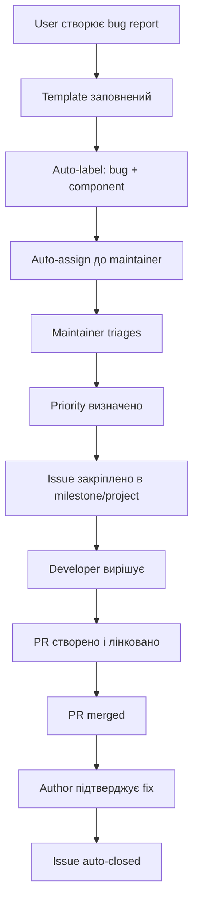
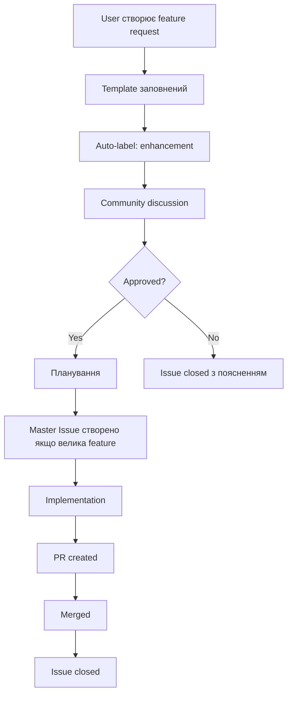
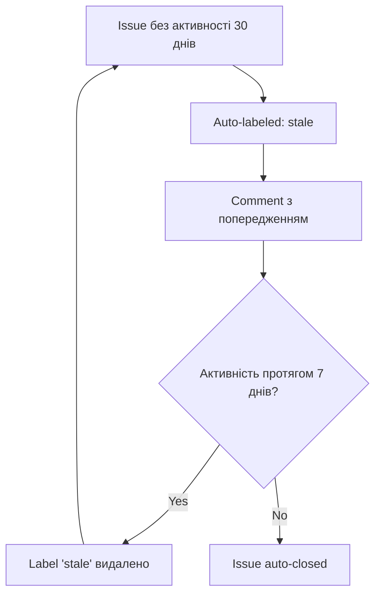

# Automated Issue Resolution System

## Огляд

Цей документ описує комплексний автоматизований механізм вирішення питань (issues) у репозиторіях екосистеми Cimeika.

**Мета**: Автоматизувати повторювані процеси, прискорити обробку issues, та забезпечити консистентність у їх управлінні.

## Компоненти системи

### 1. Automated Issue Triage (`.github/workflows/issue-automation.yml`)

GitHub Actions workflow що автоматично обробляє нові та існуючі issues.

**Функції:**

#### Auto-labeling
- Автоматичне додавання labels на основі контенту issue
- Виявлення типу: `bug`, `enhancement`, `documentation`, `security`, `performance`
- Визначення пріоритету: `priority:high`, `priority:medium`, `priority:low`
- Визначення компонента: `component:legend-ci`, `component:ci-cd`, `component:docs`

#### Auto-assignment
- Автоматичне призначення issues відповідним maintainers на основі компонента
- Налаштовується через `componentOwners` mapping

#### Welcome automation
- Автоматичне привітання для first-time contributors
- Надання корисних посилань на документацію та процеси

#### Duplicate detection
- Пошук подібних issues при створенні нового
- Попередження автору про можливі дублікати

#### Stale issue management
- Автоматичне позначення issues без активності (30+ днів)
- Закриття stale issues через 7 днів без активності
- Виключення для master issues та pinned issues

#### Auto-close on resolution
- Автоматичне закриття issues коли автор підтверджує вирішення
- Розпізнає keywords: "fixed", "resolved", "done", "виправлено", "вирішено"

### 2. Issue Templates (`.github/ISSUE_TEMPLATE/`)

Структуровані форми для створення issues з валідацією.

#### Bug Report (`bug_report.yml`)
Обов'язкові поля:
- Опис проблеми
- Кроки для відтворення
- Очікувана vs фактична поведінка
- Середовище (OS, browser, version)
- Пріоритет
- Компонент

#### Feature Request (`feature_request.yml`)
Обов'язкові поля:
- Опис проблеми яку вирішує feature
- Запропоноване рішення
- Use case
- Переваги
- Пріоритет

#### Documentation Issue (`documentation.yml`)
Обов'язкові поля:
- Тип проблеми (помилка, відсутня документація, неясне пояснення)
- Локація в документації
- Поточний стан
- Що має бути
- Чому це важливо

#### Master Issue (`master_issue.yml`)
Для великих ініціатив:
- Objective та success criteria
- Context та scope
- Timeline та milestones
- Tasks breakdown
- Technical design
- Testing strategy
- Risks та mitigation
- Acceptance criteria

### 3. Issue Analyzer Script (`scripts/issue_analyzer.py`)

Python скрипт для аналізу та автоматизації issues.

**Можливості:**

#### Content Analysis
```bash
python scripts/issue_analyzer.py suggest-labels \
  --owner Ihorog \
  --repo ciwiki \
  --title "Bug in Legend CI rendering" \
  --body "The Legend CI page shows error..."
```

Повертає:
```json
{
  "labels": ["bug", "component:legend-ci"],
  "confidence": 0.85
}
```

#### Repository Analysis
```bash
python scripts/issue_analyzer.py analyze \
  --owner Ihorog \
  --repo ciwiki
```

Надає статистику:
- Total/open/closed issues
- Label distribution
- Age distribution
- Stale issues
- Issues without labels/assignees

#### Report Generation
```bash
python scripts/issue_analyzer.py report \
  --owner Ihorog \
  --repo ciwiki \
  --output issue-report.md
```

Генерує markdown звіт з аналізом.

## Налаштування

### Встановлення

1. **Workflow активується автоматично** після merge до main
2. **Issue templates** доступні відразу при створенні нового issue
3. **Analyzer script**:
   ```bash
   pip install requests
   export GITHUB_TOKEN=your_token_here
   python scripts/issue_analyzer.py --help
   ```

### Конфігурація

#### Component Owners

Редагуйте `.github/workflows/issue-automation.yml`:

```yaml
const componentOwners = {
  'component:legend-ci': ['Ihorog'],
  'component:ci-cd': ['Ihorog'],
  'component:docs': ['Ihorog'],
  'security': ['Ihorog']
};
```

#### Stale Policy

Змініть параметри в `stale-issues` job:

```yaml
days-before-stale: 30        # Днів до позначення як stale
days-before-close: 7         # Днів до закриття stale issue
exempt-issue-labels: 'pinned,master-issue,epic'
```

#### Label Keywords

Додайте або змініть keywords для auto-labeling:

```javascript
// Bug detection
if (title.includes('bug') || body.includes('error')) {
  labels.push('bug');
}

// Add your custom keywords
if (body.includes('performance')) {
  labels.push('performance');
}
```

## Workflow для різних типів issues

### Bug Report Flow



### Feature Request Flow



### Stale Issue Flow



## Best Practices

### Для авторів issues

1. **Використовуйте правильний template**
   - Bug reports для помилок
   - Feature requests для нових функцій
   - Documentation для проблем з docs

2. **Заповнюйте всі обов'язкові поля**
   - Це допомагає автоматизації правильно класифікувати issue
   - Прискорює процес triage

3. **Будьте специфічними**
   - Конкретні titles краще для duplicate detection
   - Детальні описи допомагають auto-labeling

4. **Перевіряйте suggested duplicates**
   - Якщо бот знайшов подібні issues, перегляньте їх
   - Додайте коментар до існуючого issue замість створення дубліката

5. **Відповідайте на автоматичні повідомлення**
   - Якщо issue помічено як stale, але він актуальний - додайте коментар
   - Підтверджуйте resolution коли проблема вирішена

### Для maintainers

1. **Довіряйте але перевіряйте автоматизацію**
   - Auto-labels зазвичай точні, але перегляньте їх
   - Додайте додаткові labels якщо потрібно

2. **Використовуйте consistent labels**
   - Це покращує роботу автоматизації
   - Дивіться [Label Schema](#label-schema)

3. **Регулярно review автоматичних призначень**
   - Перевіряйте що issues призначені правильним людям
   - Оновіть `componentOwners` mapping якщо потрібно

4. **Моніторте stale issues**
   - Review issues перед тим як вони стануть stale
   - Pin важливі issues щоб вони не були автоматично закриті

5. **Використовуйте analyzer для insights**
   - Запускайте reports регулярно
   - Ідентифікуйте patterns та bottlenecks

## Label Schema

### Type Labels
- `bug` — Щось не працює як очікується
- `enhancement` — Нова функція або покращення
- `documentation` — Покращення документації
- `security` — Проблеми безпеки
- `performance` — Оптимізація продуктивності
- `refactor` — Рефакторинг без зміни функціональності

### Priority Labels
- `priority:high` — Критично, потребує негайної уваги
- `priority:medium` — Важливо, але не терміново
- `priority:low` — Nice to have

### Component Labels
- `component:legend-ci` — Legend CI module
- `component:ci-cd` — CI/CD workflows
- `component:docs` — Documentation
- `component:scripts` — Automation scripts

### Status Labels
- `needs-triage` — Потребує первинного review
- `needs-investigation` — Потребує deeper investigation
- `needs-discussion` — Потребує team discussion
- `needs-approval` — Потребує stakeholder approval
- `blocked` — Заблоковано іншим issue або зовнішнім фактором
- `stale` — Немає активності протягом 30+ днів

### Special Labels
- `master-issue` — Master issue для великої ініціативи
- `epic` — Великий epic з множиною sub-tasks
- `good-first-issue` — Добре для нових contributors
- `help-wanted` — Потрібна допомога community
- `duplicate` — Дублікат існуючого issue
- `wontfix` — Не буде виправлено
- `invalid` — Невалідний issue

## Metrics та моніторинг

### Key Metrics

Відслідковуйте ці метрики для оцінки ефективності:

1. **Time to First Response**
   - Скільки часу займає перший відповідь на новий issue
   - Target: < 24 години

2. **Time to Triage**
   - Час від створення до видалення `needs-triage` label
   - Target: < 48 годин

3. **Time to Resolution**
   - Час від створення до закриття issue
   - Залежить від типу та priority

4. **Auto-label Accuracy**
   - Відсоток issues де auto-labels були правильними
   - Target: > 80%

5. **Duplicate Detection Rate**
   - Відсоток знайдених дублікатів
   - Допомагає уникнути зайвої роботи

### Регулярні Reports

Запускайте щотижневі reports:

```bash
# Generate weekly report
python scripts/issue_analyzer.py report \
  --owner Ihorog \
  --repo ciwiki \
  --output weekly-issue-report-$(date +%Y-%m-%d).md
```

Аналізуйте:
- Тренди в кількості issues
- Distribution по labels
- Stale issues що потребують уваги
- Issues без assignees

## Troubleshooting

### Workflow не запускається

1. Перевірте permissions в workflow file
2. Перевірте що workflow enabled в Settings → Actions
3. Перегляньте Actions logs для помилок

### Auto-labels неточні

1. Оновіть keywords в workflow
2. Збільште кількість контексту що аналізується
3. Додайте domain-specific terms

### Багато false-positive duplicates

1. Підвищіть threshold similarity (зараз 0.5)
2. Покращіть title guidelines в templates
3. Додайте більше context до similarity algorithm

### Issues неправильно призначені

1. Оновіть `componentOwners` mapping
2. Перевірте що component labels правильні
3. Розгляньте додавання більше детальних component labels

## Розширення системи

### Додавання нових issue types

1. Створіть новий template у `.github/ISSUE_TEMPLATE/`
2. Додайте відповідні labels в auto-labeling logic
3. Оновіть documentation

### Інтеграція з external tools

Автоматизація може бути розширена для:
- Slack/Discord notifications
- Jira synchronization
- Project board automation
- Email notifications
- Metrics dashboards

### Custom automation scripts

Додайте власні скрипти у `scripts/`:
- Issue priority calculator
- SLA tracker
- Burndown charts
- Custom reports

## Anti-repeat принцип

Ця автоматизація безпосередньо реалізує anti-repeat принцип:

**Проблема**: Maintainers вручну triaging кожен issue, додаючи labels, призначаючи людей, шукаючи дублікати.

**Рішення**: Автоматизувати всі повторювані tasks через workflows, templates та scripts.

**Результат**:
- ✅ Maintainers можуть фокусуватись на вирішенні issues, не на адмініструванні
- ✅ Консистентний процес для всіх issues
- ✅ Швидший response time
- ✅ Менше людських помилок
- ✅ Кращий user experience для contributors

## Додаткові ресурси

- [GitHub Actions Documentation](https://docs.github.com/en/actions)
- [Issue Templates Guide](https://docs.github.com/en/communities/using-templates-to-encourage-useful-issues-and-pull-requests)
- [GitHub REST API](https://docs.github.com/en/rest)
- [Master Issue Workflow](./master-issue.md)
- [PR Process](./pr-process.md)

## Feedback та покращення

Ця система постійно еволюціонує. Якщо у вас є ідеї для покращення:

1. Створіть issue з label `enhancement` та `component:automation`
2. Опишіть проблему яку automation може вирішити
3. Запропонуйте implementation approach

Всі suggestions welcome! 🚀
